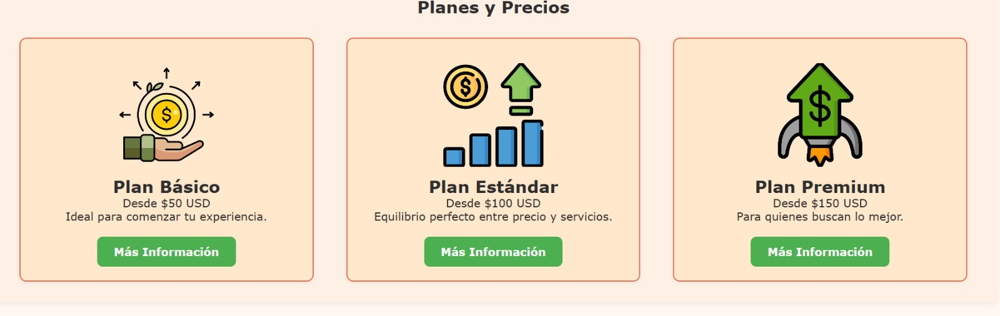

# Expansión de Sitio Web de Emprendimiento Digital

# Descripcion 📋
El objetivo principal es ofrecer una plataforma visualmente atractiva, de navegación intuitiva y con diseño responsivo que mejore la experiencia del usuario. Se emplearon tecnologías como HTML y CSS para construir una interfaz moderna, con colores suaves y tarjetas informativas organizadas. La estructura del sitio permite mostrar claramente los planes y servicios disponibles. Logrando asi mejorar un sitio web de una manera mas atractiva y organizada para los usuarios. 

# Estructura de carpetas y archivo 
LABORATORIO-CSS/Emprendimiento-Digital
│
├── estilos.css/
│   
│
├── img/
│   
│
├── pages/
│  
│
├── index.html
├── nosotros.html
├── servicios.html
└── README.md
## Caracteristicas Implementadas 🛠️

Creacion de paginas principales para la pagina y 3 planes- Basico, Estandar y Premiun 
Implementacion de Estilos CSS para un diseño mas atractivo 
Implementacion de imagenes 
Implementacion de estilo Responsive
Creacion de un Readme para informacion de la pagina web y integracion de enlaces de contacto 

# Capturas de Pantalla
 
 

# Autores 
* **Kevin Danilo Salas Zapata** - *Trabajo Inicial* - [Kevin_Salas](https://github.com/kevinsalsss)

---
⌨️ con ❤️ por [Kevin_Salas]