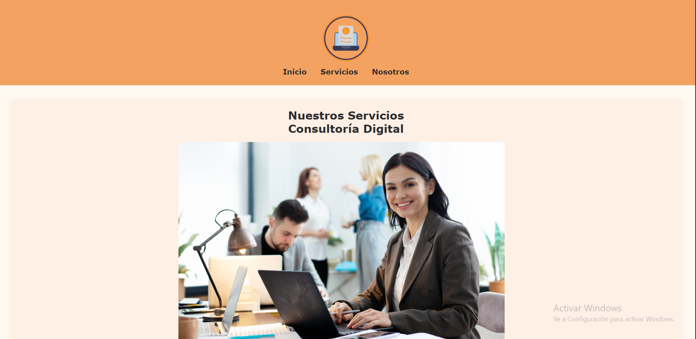

# Expansión de Sitio Web de Emprendimiento Digital

# Descripcion 📋
El objetivo principal es ofrecer una plataforma visualmente atractiva, de navegación intuitiva y con diseño responsivo que mejore la experiencia del usuario. Se emplearon tecnologías como HTML y CSS para construir una interfaz moderna, con colores suaves y tarjetas informativas organizadas. La estructura del sitio permite mostrar claramente los planes y servicios disponibles. Logrando asi mejorar un sitio web de una manera mas atractiva y organizada para los usuarios. 

# Estructura de carpetas y archivo 
Emprendimiento-Digital
*estilos.css
*img
*pages
*index.html
*nosotros.html
*servicios.html
*README.md
## Caracteristicas Implementadas 🛠️

Creacion de paginas principales para la pagina y 3 planes- Basico, Estandar y Premiun 
Implementacion de Estilos CSS para un diseño mas atractivo 
Implementacion de imagenes 
Implementacion de estilo Responsive
Creacion de un Readme para informacion de la pagina web y integracion de enlaces de contacto 

# Capturas de Pantalla
 
 

# Autores 
* **Kevin Danilo Salas Zapata** - *Trabajo Inicial* - [Kevin_Salas](https://github.com/kevinsalsss)

---
⌨️ con ❤️ por [Kevin_Salas]